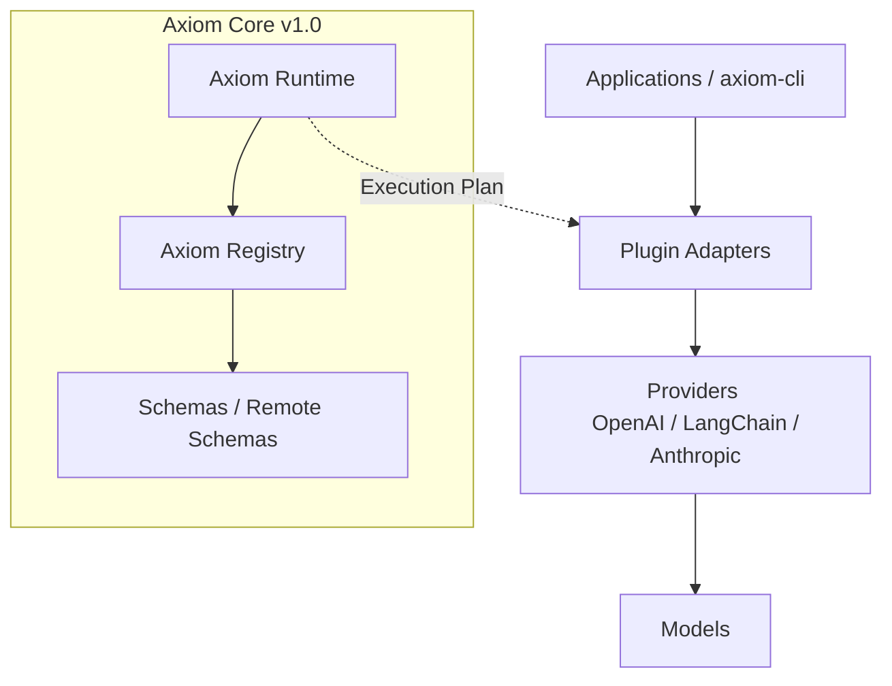

# AXIOM — Universal Prompt & Skill Runtime v1.0

Universal schema-based runtime for prompts, skills, and AI composition. Framework-independent, portable, and genuinely enterprise-ready.

## 1. Overview

Axiom v1.0 is a strictly decoupled, universal, schema-based compiler for orchestrating prompts, templates, skills, and dynamic workflows across differing AI frameworks and providers.

Axiom is explicitly designed to be:
- **Framework Independent**
- **Schema Driven & Deterministic**
- **Strictly Version-Locked**
- **Stateless Offline-Compilable**
- **Extensible via Plugins**

Axiom is NOT an agent framework, context engine, or provider SDK. It is the enterprise compilation layer resting firmly beneath LangChain, Semantic Kernel, and DSPy, transforming declarative graph models into immutable ExecutionPlans.

## 2. Core Extensibility Architecture



## 3. The 5 Core Concepts

| Term | Meaning |
|---|---|
| **Template** | Reusable structured message blueprint `(e.g., base.agent)` |
| **Prompt** | Executable instance inheriting a Template `(e.g., prompt.chat)` |
| **Skill** | Execution configuration aggregating Prompts |
| **UseCase** | High-level linear combination solving an objective |
| **Workflow** | Declarative branching DAG mapping conditional execution paths |

## 4. The Registry Firewall

The `AxiomRegistry` enforces an absolute `id@version` deterministic firewall:
- **Collision Immunity**: The registry detones violently onto identical semantic constraints natively preventing overlapping state injections.
- **Remote Ecosystem**: Axiom effortlessly loads remote HTTPS objects offline bridging strictly against local dependencies safely `registry.load_remote(url)`.
- **Capability Discovery**: Query intersecting taxonomies via `registry.query(capability="router", tag="prod")` yielding highest deterministically pinned models natively.

## 5. The Compiler Engine

The `AxiomRuntime` does not execute prompts, evaluate Python, or mutate network pipelines. It reads entrypoints mapping variables safely over strict declarative nodes—generating immutable flattened `ExecutionPlan` JSON outputs inherently pinning native execution schemas natively.

Example Compiler Command:
```python
runtime = AxiomRuntime(registry)
plan = runtime.build("workflow.router", {"intent": "refund"})
```

## 6. Ecosystem Extensions

### The CLI
Axiom's CLI validates and compiles systems declaratively completely offline:
```bash
axiom validate registry/
axiom build registry workflow.router
axiom run registry workflow.router --adapter openai
axiom search registry --tag prod
```

### The Translators
External Integrations consume our AST definitions offline effortlessly. Build or route any generic downstream system utilizing native plugins mapping directly against the Phase 8 extensible Plugin Registry.

---

**Axiom Core is officially sealed. No breaking architecture drifts or undocumented framework dependencies. Just pure declarative determinism.**